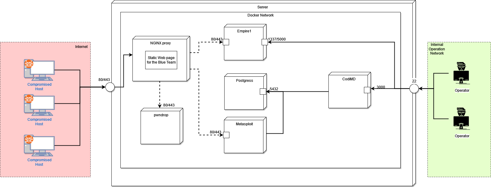

# Red-Team-Infrastructure
A testing Red Team Infrastructure created with Docker.
You can deploy this Infrastructure on any PC and start to pwn everything you want!

# Structure

The Infrastructure Comprehends the following services:
- **NGINX** (https://www.nginx.com/): It's the only service exposed and it's used as a proxy for the different internal services.
- **Empire** (https://github.com/BC-SECURITY/Empire): Post Exploitation C2.
- **Metasploit** (https://github.com/rapid7/metasploit-framework): Exploiting framework.
- **pwndrop** (https://github.com/kgretzky/pwndrop): It's used to serve our files and payloads.
- **Postgress** (https://www.postgresql.org): Database used by CodiMD and Metasploit.
- **CodiMD**(https://github.com/hackmdio/codimd): Note-taking service.

# Deployment
    docker-compose up -d

# Accessing the services

## pwndrop
Go to the following link

    127.0.0.1:8080/redteaminfra-pwndrop

Next, you need to create the account and then you'll be able to start to upload your payload!

## Empire
To connect to the Empire server you have 2 options:
### Attach to the container
    docker exec -it {container-id} ./ps-empire client
### Exposing the Empire server ports (Not suggested)
You can expose the Empire server ports by modifying the docker-compose file:

    empire:
    image: bcsecurity/empire:latest
    volumes:
    - empire-data:/opt/empire/
    ports:
    - "<YOUR-IP or 0.0.0.0>:1337:1337"
    - "<YOUR-IP or 0.0.0.0>:5000:5000"
    stdin_open: true
    tty: true
    restart: on-failure

## Metasploit
You can use Metaslpoit by running the following command:

    docker exec -it {container-id} ./msf-console

## CodiMD
You can access CodiMD from the following link:

    127.0.0.1:8080/redteaminfra-pwndrop
or

    <YOUR-IP>/redteaminfra-pwndrop
    
# Support
For any question you can join the INE/eLearnSecurity Discord server (https://discord.gg/n9rySGQgPa) or contact me on discord: Z3r0n37#3285! :D
